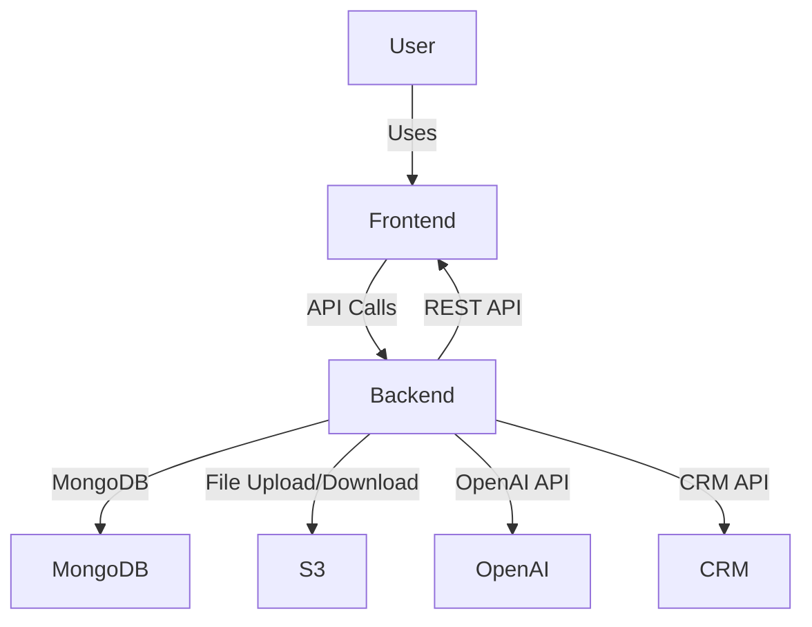

# DocNexus: Healthcare Workflow Automation Platform

Welcome to **DocNexus** – a full-stack web application designed to make healthcare professionals’ lives easier by automating the messy, manual parts of managing meetings, transcripts, and documents. This project is built with real-world deployment in mind, using modern best practices for both code and cloud.

---

## 🚀 What is DocNexus?

DocNexus is your all-in-one solution for:
- **Uploading and transcribing medical meeting audio/video**
- **AI-powered analysis** (sentiment, key insights, action items)
- **Generating professional PDF and PowerPoint reports**
- **Seamless CRM integration** (Salesforce)
- **Analytics dashboard** for actionable insights

It’s built to be robust, cloud-ready, and easy for teams to use and extend.

---

## 🏗️ How is it Built?

**DocNexus** is a classic, scalable full-stack app:

```
DocNexus/
│
├── client/      # React frontend (Material-UI, modern UX)
└── server/      # Node.js/Express backend (MongoDB, AWS S3, OpenAI)
```

### **Architecture Overview**



### **Frontend**
- **React** (with hooks, context, and Material-UI for a clean, modern look)
- **SPA routing** (works on any cloud host, including Render)
- **Responsive and accessible** (mobile-friendly, keyboard navigation)

### **Backend**
- **Express.js** REST API
- **MongoDB** (Mongoose models for transcripts, users, etc.)
- **AWS S3** for all file storage
- **OpenAI** for transcription and analysis
- **Salesforce/CRM** integration 
- **Robust error handling, logging, and security (Helmet, CORS, rate limiting)**

---

## 🛠️ Setup: Get Running in Minutes

**Prerequisites:**  
- Node.js 
- npm
- MongoDB (local or Atlas)
- AWS S3 bucket (for file storage)
- OpenAI API key

### **1. Clone the Repo**
```bash
git clone https://github.com/your-username/DocNexus_Teresha_Assignment.git
cd DocNexus_Teresha_Assignment
```

### **2. Backend Setup**
```bash
cd server
cp env.example .env   # Fill in your MongoDB, AWS, and OpenAI details
npm install
npm start           # Starts backend on http://localhost:5000
```

### **3. Frontend Setup**
```bash
cd client
cp env.example .env   # (Optional) Add frontend env vars if needed
npm install
npm start             # Starts React app on http://localhost:3000
```

---

## 🌐 **Cloud-Ready by Design**

- **All file uploads go to S3**
- **SPA routing works on Render, Netlify, Vercel, etc.**
- **Environment variables for all secrets/config**
- **Health and environment check endpoints for easy debugging**

---


## 📊 **Feature Highlights**

- **Audio/video upload** with drag-and-drop
- **AI transcription** (OpenAI Whisper)
- **Sentiment & insights analysis** (OpenAI GPT)
- **PDF & PPT generation** (one click, branded, and beautiful)
- **CRM sync** (Salesforce)
- **Analytics dashboard** (see trends, top HCPs, and more)

---

## 🧑‍💻 **For Developers**

- **Easy to read, easy to extend:**  
  - Add new endpoints in `server/routes/`
  - Add new UI pages in `client/src/pages/`
- **Clear error messages and logs**

---

## 📬 **Questions?**

Open an issue, or reach out on LinkedIn/E-mail.  

