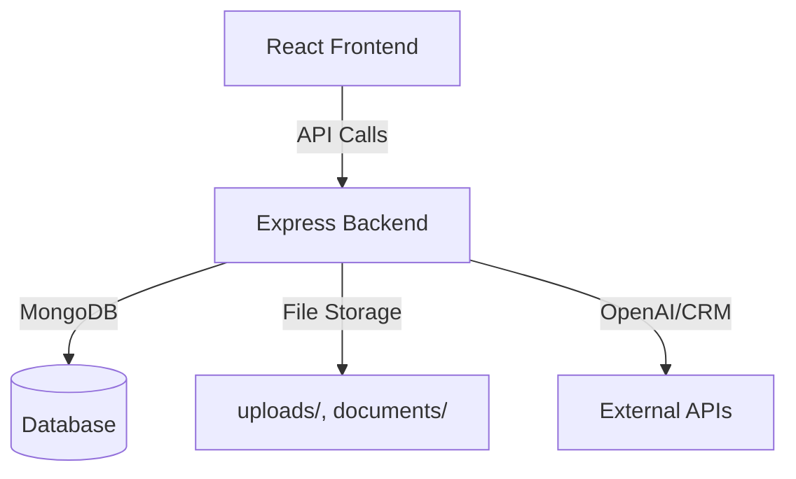

# DocNexus Assignment

Welcome to the DocNexus Assignment! This project is a full-stack web application designed to help healthcare professionals manage transcripts, generate documents, and integrate with CRM systems. Below, you'll find everything you need to know to get started, understand how things work, and make the most of this codebase.

---

## Table of Contents
- [Project Overview](#project-overview)
- [How the App is Structured](#how-the-app-is-structured)
- [Getting Started (Setup Guide)](#getting-started-setup-guide)
- [How Everything Works](#how-everything-works)
- [Key Features](#key-features)
- [Project Architecture](#project-architecture)
- [Troubleshooting & Tips](#troubleshooting--tips)
- [Contributing](#contributing)
- [Contact](#contact)

---

## Project Overview

DocNexus is built to make it easy for healthcare teams to upload audio or video files, get them transcribed, analyze the content, generate professional documents (like PDFs and PowerPoints), and sync everything with CRM systems such as Salesforce. The app is split into two main parts: the frontend (what users see) and the backend (where the heavy lifting happens).

---

## How the App is Structured

Here’s a quick look at the folder structure:

```
DocNexus_Teresha_Assignment/
│
├── client/      # The React frontend (user interface)
└── server/      # The Node.js/Express backend (API, logic, database)
```

### 1. `client/` — The Frontend
- **Built with:** React and Material-UI
- **Main folders:**
  - `src/pages/` — Main screens (Dashboard, Upload, Transcripts, etc.)
  - `src/components/` — Reusable UI pieces (like dialogs and layouts)
  - `src/services/` — Handles API calls to the backend
  - `src/contexts/` — Manages authentication state
- **Styling:** Uses Material-UI for a modern look, plus some custom CSS.

### 2. `server/` — The Backend
- **Built with:** Node.js, Express, MongoDB (via Mongoose)
- **Main folders:**
  - `routes/` — API endpoints (upload, transcripts, CRM, etc.)
  - `models/` — Database models (for MongoDB)
  - `services/` — Business logic (file handling, OpenAI, CRM, etc.)
  - `uploads/` and `documents/` — Where uploaded and generated files are stored

---

## Getting Started (Setup Guide)

Here’s how to get the app running on your machine:

### Prerequisites
- **Node.js** (v16 or newer)
- **npm** (comes with Node.js)
- **MongoDB** (local or cloud, e.g., MongoDB Atlas)

### 1. Clone the Repository
```bash
git clone https://github.com/your-username/DocNexus_Teresha_Assignment.git
cd DocNexus_Teresha_Assignment
```

### 2. Set Up the Backend
```bash
cd server
cp env.example .env   # Copy the example environment file and fill in your details
npm install
npm run dev           # Starts the backend server on http://localhost:5000
```
- Make sure your `.env` file has the correct MongoDB connection string and any API keys you need.

### 3. Set Up the Frontend
Open a new terminal window/tab:
```bash
cd client
cp env.example .env   # (Optional) Add frontend environment variables if needed
npm install
npm start             # Starts the React app on http://localhost:3000
```

---

## How Everything Works

- **Uploading Files:** Users can upload audio or video files from the dashboard. These files are sent to the backend for processing.
- **Transcription:** The backend uses OpenAI and other services to transcribe the audio/video into text.
- **Analysis:** The app can analyze transcripts for sentiment, key insights, and more.
- **Document Generation:** Users can generate PDF or PowerPoint documents from transcripts with a click.
- **CRM Integration:** Transcripts and documents can be synced with external CRM systems (like Salesforce) for easy follow-up and record-keeping.
- **Dashboard & Analytics:** The dashboard gives you a quick overview of recent activity and analytics.

---

## Key Features
- **Modern, clean UI** built with React and Material-UI
- **Audio/video upload and transcription**
- **Document generation** (PDF, PPT)
- **CRM integration** (e.g., Salesforce)
- **Analytics dashboard**
- **Role-based authentication** (demo mode by default)

---

## Project Architecture

Here’s a simple diagram to show how everything connects:



- **Frontend:** Handles everything the user sees and interacts with. Talks to the backend via API calls.
- **Backend:** Handles all the business logic, file processing, and communication with the database and external APIs.
- **Database:** Stores users, transcripts, and document data.
- **File Storage:** Uploaded and generated files are stored on disk.
- **External APIs:** Integrates with OpenAI for transcription and CRM systems for syncing data.

---

## Troubleshooting & Tips
- If you get errors about missing environment variables, double-check your `.env` files in both `client` and `server`.
- Make sure MongoDB is running and accessible.
- If you change backend code, restart the server to see your changes.
- If you want a clean slate, you can delete the `uploads/` and `documents/` folders (but you’ll lose all uploaded/generated files).

---

## Contributing

Want to help improve this project? Awesome! Here’s how:
1. Fork the repo and create a new branch.
2. Make your changes.
3. Open a pull request with a clear description of what you did.

---

## Contact

If you have questions, run into issues, or just want to say hi, feel free to open an issue on GitHub or reach out to the maintainer.

---

**Thanks for checking out DocNexus! We hope it makes your workflow easier and more efficient.** 

---

## Code Structure & Architecture (Summary)

This codebase is **well-structured** and follows best practices for full-stack JavaScript applications:

- **Separation of Concerns:**
  - The frontend (`client/`) and backend (`server/`) are cleanly separated.
  - All business logic is in `server/services/`, API endpoints in `server/routes/`, and data models in `server/models/`.
  - The frontend uses React components, context, and services for maintainability.

- **Modular Design:**
  - Each feature (transcription, analysis, document generation, CRM integration) is encapsulated in its own service or route.
  - Easy to extend or modify individual features without breaking others.

- **Clear Setup Instructions:**
  - See the [Getting Started (Setup Guide)](#getting-started-setup-guide) section above for step-by-step instructions.
  - Environment variables are managed via `.env` files for both frontend and backend.

- **Architecture Overview:**
  - The app uses a modern MERN-like stack (React, Node.js/Express, MongoDB).
  - File uploads and generated documents are stored locally in organized folders.
  - Integrates with OpenAI for AI-powered features and with CRM systems for business workflows.

For more details, see the sections above or explore the codebase. If you have questions, check the [Contact](#contact) section.

--- 